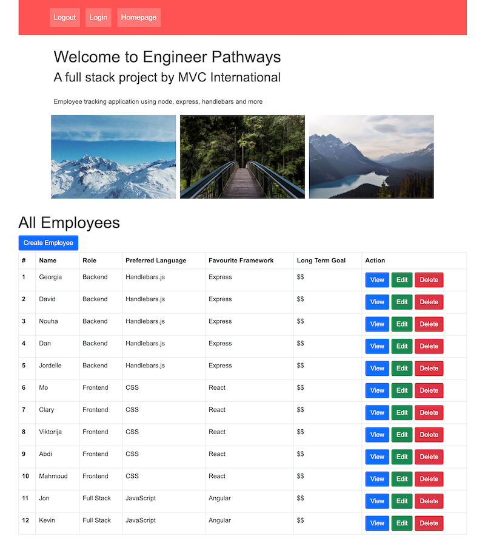

# Engineer Pathways

## Overview

This is a full stack, user-friendly project to track your team of software developers.  
It allows you to monitor their id, name, role, preferred language, favourite framework/technologies and ideal working style (e.g. work from home/office/hybrid).  
We have built this using handlebars as the templating engine, combined with node/express, mySQL and Sequelize to sync the data.

## User Story

```
AS A manager of several developers
I WANT a dynamic user management system
SO THAT my company can help employees to improve their skills
WHEN I start the application
I AM given the option to add each employee's id, name, role, preferred language, favourite framework/technologies and ideal working style
ALSO there is the functionality to view/edit/delete this information as required
```

## Instructions

Before setup, install [XAMPP](https://www.apachefriends.org/download.html) and use it to create a database called "eps" (check specific steps for your device with google/youtube).

Download or clone this repo, navigate to where you have stored the folder and follow these steps:

1. Open integrated terminal or use your main CLI.
2. Run `npm install` to set up dependencies.
3. Run `npx sequelize-cli init` then `npx sequelize-cli db:migrate`  
   to migrate database to XAMPP for testing/development.  
   NOTE (these 2 commands use npx, not npm)
4. Use `npm start` command to run the app locally.
5. In your browser, you can now use the system on `localhost:3000`.

Alternatively, just run the app on Heroku using the link provided above.

## Screenshot


